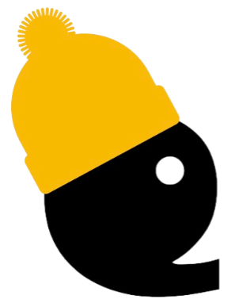

    

<h1 align="center">Headuard API Reference</h1>

## `createTitle(attributes: TitleTag): HTMLTitleElement`

Creates a `<title>` element and appends it to the document head.

- **Parameters**:
  - `attributes` (required): An object containing attributes for the `<title>` element. It must include a `textContent` property.

- **Returns**:
  - Returns the created `<title>` element.

---

## `createBase(attributes: BaseTag): HTMLBaseElement`

Creates a `<base>` element and appends it to the document head.

- **Parameters**:
  - `attributes` (optional): An object containing attributes for the `<base>` element. It may include `href` and `target` properties.

- **Returns**:
  - Returns the created `<base>` element.

---

## `createMeta(attributes: MetaTag): HTMLMetaElement`

Creates a `<meta>` element and appends it to the document head.

- **Parameters**:
  - `attributes` (optional): An object containing attributes for the `<meta>` element. It may include `httpEquiv`, `name`, `content`, and `charset` properties.

- **Returns**:
  - Returns the created `<meta>` element.

---

## `createScript(attributes: ScriptTag): HTMLScriptElement`

Creates a `<script>` element and appends it to the document head.

- **Parameters**:
  - `attributes` (optional): An object containing attributes for the `<script>` element. It may include `type`, `defer`, `src`, `async`, `crossOrigin`, `integrity`, `noModule`, `nonce`, and `referrerPolicy` properties.

- **Returns**:
  - Returns the created `<script>` element.

---

## `createLink(attributes: LinkTag): HTMLLinkElement`

Creates a `<link>` element and appends it to the document head.

- **Parameters**:
  - `attributes` (optional): An object containing attributes for the `<link>` element. It may include `hreflang`, `href`, `imageSizes`, `rel`, `imageSrcset`, `crossOrigin`, `referrerPolicy`, `integrity`, `media`, `title`, `type`, and `as` properties.

- **Returns**:
  - Returns the created `<link>` element.

---

## `unmount(headElement: HeadElement): HTMLHeadElement`

Unmounts a head element from the document head.

- **Parameters**:
  - `headElement` (required): The head element to unmount.

- **Returns**:
  - Returns the unmounted `<head>` element.